# Model Masher

> Hi, I'm Pat. This was one of my first real forays into AI engineering, built in 2023 when
> Stable Diffusion 1.5 and ControlNet were the state of the art. The goal was to wrap a 3D
> object cleanly in a single generated image. The catch is that UV maps are laid out for
> texture packing efficiency, not for human logic, so a diffusion model painting on a UV
> sheet has no idea which pieces are neighbours once the model is assembled.

> **Status: archived.** I'm not actively working on this anymore. It's left up as a record of
> the problem and the two very different approaches I took at it. If the problem space
> interests you, the writeups below are the useful part.

## The problem

I started this trying to generate better car liveries for Assetto Corsa Competizione. ACC
takes a single `decals.png` in the car's UV layout and wraps the model in it. Stable Diffusion,
meanwhile, produces one coherent 2D image. Those two things do not naturally agree.

A UV map is packed by an artist or an algorithm to waste as little texture space as possible.
The result is that a car's roof can sit on the sheet directly beside a wheel arch, a door can be
mirrored and rotated 90 degrees, and a bumper can be split across three islands on opposite
corners of the image. Here is a real one:

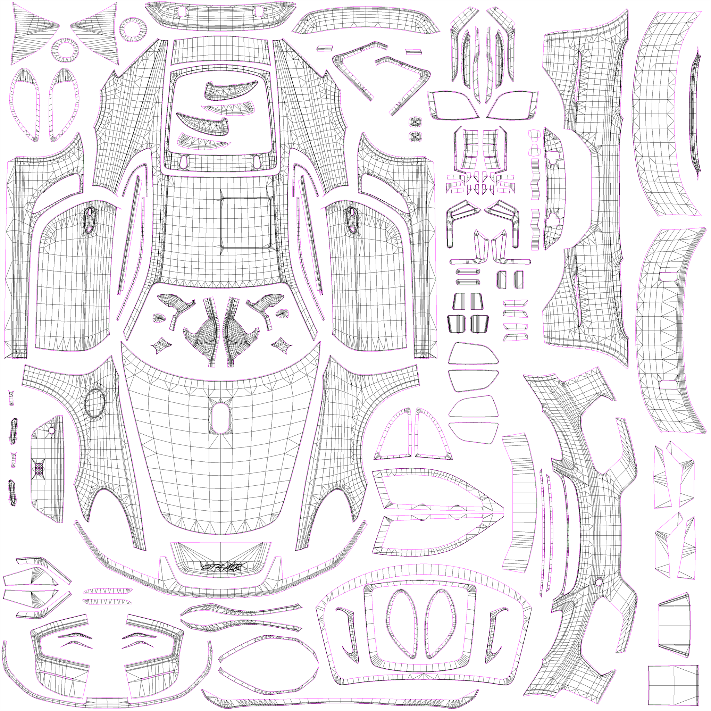

Point a diffusion model at that and you get a technically valid texture that looks like confetti
on the car. Every island is painted as if it were an independent picture, so nothing lines up
across a seam. Early experiments with ControlNet and custom LoRAs ran straight into this: the
model has no concept of which pieces are physically adjacent in the compiled OBJ.

Both versions of Model Masher are attempts to close that gap, from opposite directions.

| | **V1: 2D piece remapping** | **V2: 3D projection bake** |
|---|---|---|
| Idea | Rearrange the UV islands into a human logical layout, generate on *that*, then move every piece back | Project the generated image onto the actual mesh in 3D, then bake the result into the model's real UVs |
| Where the geometry knowledge comes from | A human, dragging pieces around in a browser | Blender, which already knows the surface to UV mapping |
| Per model setup | Manual arrangement, saved as JSON | None. Feed it the OBJ |
| Transform support | Translate and rotate only | Whatever the projection material does, including curvature |
| Result | Big improvement, still seam heavy | Genuinely continuous artwork across panels |

---

# V2: project onto the model, bake into the UVs

V1 tried to make the UV sheet make sense to the AI. V2 stopped fighting the UV sheet entirely.

The insight is that the 3D application already has the mapping I was trying to reconstruct by
hand. Blender knows exactly which point on the mesh surface corresponds to which pixel in the
UV layout. So instead of shuffling islands around in 2D, project the generated image onto the
mesh in world space, let it drape over the geometry, and then bake that surface back down into
the model's own UV layout. The bake output is a texture the game can load directly, with no
arrangement step and no per model JSON.

### The pipeline

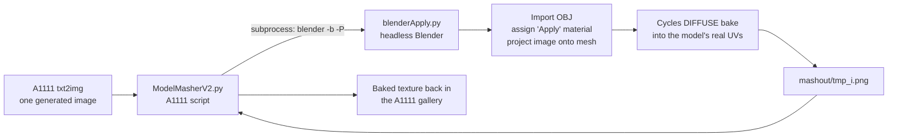

**`V2/ModelMasherV2.py`** is an Automatic1111 script, so it lives inside the normal generation
flow and its only UI input is an OBJ file. It runs generation as usual, saves each image, then
shells out to Blender in background mode:

```
blender modelmasher/material2.blend -b -P modelmasher/blenderApply.py -- \
    <your.obj> <a1111>/mashout/tmp <bake_size> <image_0.png> <image_1.png> ...
```

The whole batch goes over in one call, so Blender starts once and bakes every image in the
batch. When it exits, the script reads the baked PNGs back off disk and appends them to the
A1111 results, which means the mashed textures show up in the gallery right next to the raw
generations. Nothing leaves the web UI.

**`V2/modelmasher/blenderApply.py`** is the part that runs inside Blender:

1. Creates a float buffer bake target (`BakeImage2`) sized from the generation width.
2. Imports the OBJ and walks the object tree recursively, so child meshes get picked up too.
   Any mesh that arrives without UVs gets a smart UV project as a fallback.
3. Assigns the `Apply` material from `material2.blend` to every mesh, then adds an Image Texture
   node holding the bake target and marks it active. That last detail is the whole bake contract
   in Cycles: it writes into whichever image texture node is active on the material.
4. For each generated image: load it, plug it into the projection nodes in `Apply`, select all
   meshes, bake `DIFFUSE`, and save the result as a 16 bit PNG.

**`V2/modelmasher/material2.blend`** holds the `Apply` material, which is the actual trick and
the piece that was built by hand in Blender rather than in code. It drives the generated image
through texture coordinate and mapping nodes so the image is *projected* onto the surface from
multiple directions and mixed, rather than sampled through the mesh's UVs. The Python side just
swaps the image into those nodes and pulls the bake lever. Baking then resolves whatever landed
on the surface into UV space, which is exactly the transformation V1 was trying to approximate
with contours and affine matrices.

### It works

One generated image in, one baked texture out, one wrapped car:

| Generated | Baked into the UV layout | In game |
|---|---|---|
| 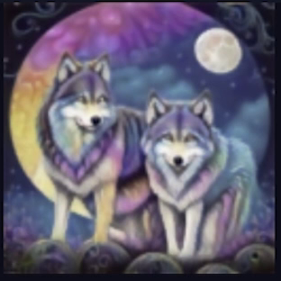 | 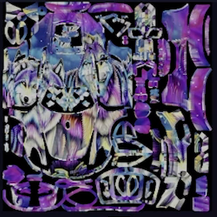 | 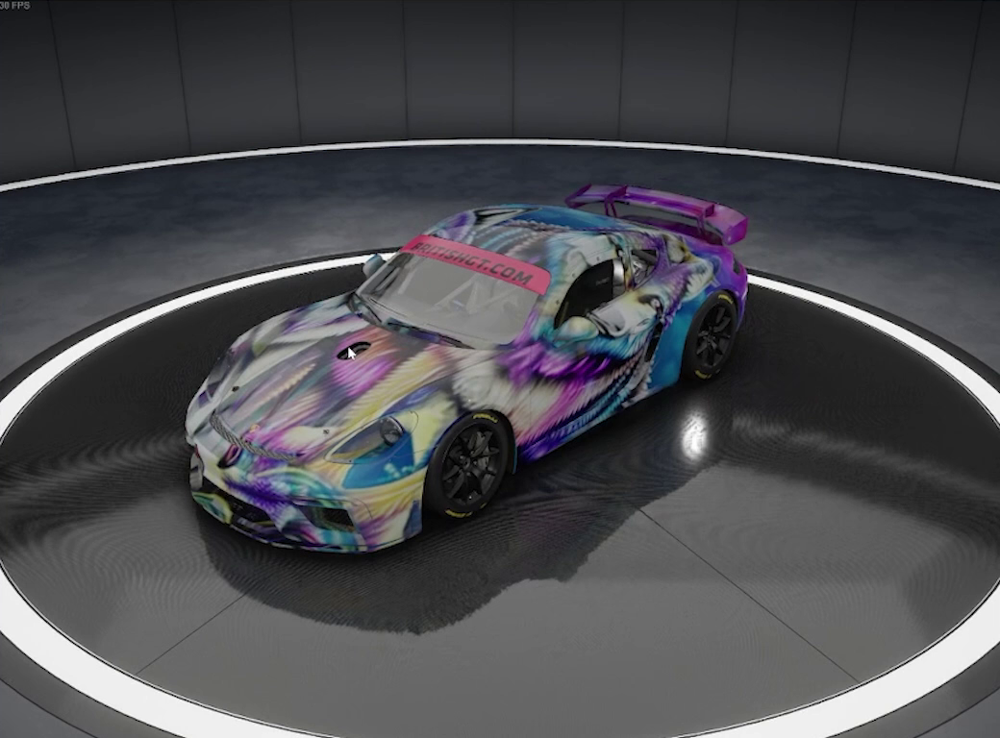 |

Look at the middle image. It is chopped into the car's real UV islands, but the content inside
each island is *placed*: the wolves land on the doors, the moon lands where the moon should be,
and the artwork runs continuously across panels that sit nowhere near each other on the texture
sheet. That is the thing V1 could only approximate.

There's a full one minute screen capture of a V2 run in
[`readmeimg/ModelMasher.mp4`](readmeimg/ModelMasher.mp4): prompt, generate, Blender spins up
headless in the console, bake comes back into the gallery, load it in ACC.

### Running V2

**Prerequisites**

- [Automatic1111's Stable Diffusion web UI](https://github.com/AUTOMATIC1111/stable-diffusion-webui)
- Blender 3.x, available on your PATH as `blender`
- An OBJ of your model carrying the game's UV layout

**Setup**

- Copy `V2/ModelMasherV2.py` and the whole `V2/modelmasher/` folder into the web UI's `scripts` folder.
- Create a `mashout` folder in the web UI root. Blender writes bakes to `mashout/tmp_<i>.png` and
  will not create the directory for you.

**Use**

- In txt2img, set your prompt and size as normal. Width is what sets the bake resolution, and the
  bake target is square.
- Under Script, pick **Model MasherV2** and upload your OBJ.
- Generate. The raw images appear first, then the baked ones once Blender finishes.
- Save a baked image as your `decals.png`.

### Known rough edges

This is where it stood when I stopped, and it's worth being upfront about it:

- **Projection blind spots.** Anything the projection cannot see cleanly, undersides, occluded
  geometry, faces nearly parallel to the projection axis, smears. This was the main thing left to
  solve and the reason a real triplanar or camera array setup would be the next step.
- **Blender 3.x only.** The importer call is `bpy.ops.import_scene.obj`, which Blender 4.0 removed
  in favour of `bpy.ops.wm.obj_import`. One line to fix, never fixed.
- **Fragile node hookup.** The material's projection nodes are addressed by Blender's auto
  generated names (`Image Texture.001`, `Image Texture.006`), so editing the blend can quietly
  break the wiring.
- **Subprocess errors are console only.** If Blender fails, the web UI just returns fewer images.
- **Bring your own OBJ.** The sample models that shipped early on were dropped from the repo to
  keep it from ballooning.

---

# V1: rearrange the UV sheet, then put it back

V1 attacks the same problem from the 2D side, and it's the version with the complete, tested
workflow. The idea: if the UV layout is illogical, build a *logical* one, let Stable Diffusion
paint on that, and then apply the inverse of every rearrangement to snap each piece back to
where the game expects it.

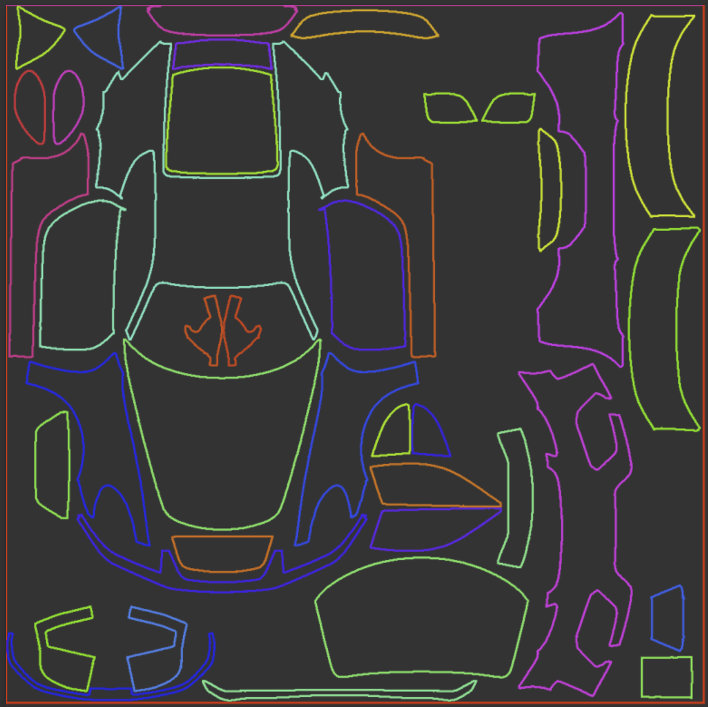
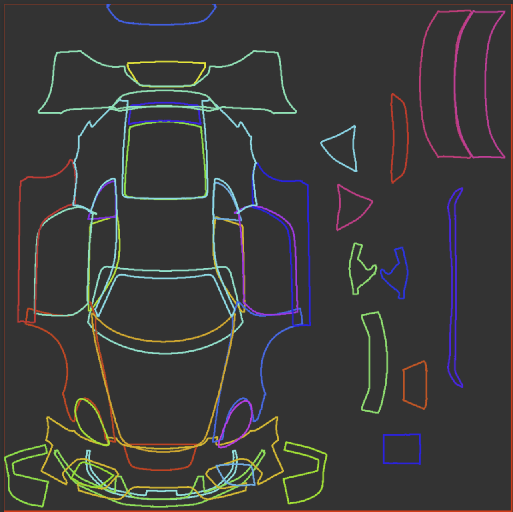

### The Arrangement Tool

`V1/ArrangementTool/` is a small Flask and OpenCV service with a Canvas2D front end.

**Detection.** You upload the UV template, either a wireframe export or a black and white mask.
The server measures mean intensity to work out which it got: a wireframe is mostly white, so it
isolates the coloured island borders (pixels that are neither pure white nor near black) and
thresholds those. A mask just gets a straight binary threshold. Either way it runs
`cv2.findContours` with `RETR_EXTERNAL`, drops anything below the area threshold you set (that's
the "how much detail do I want to hand place" knob), and computes each piece's centroid from
image moments plus a bounding box.

**Arrangement.** The browser renders every contour as a coloured outline you can drag. Right
click rotates in 22.5 degree steps, alt drops that to 11.25, ctrl reverses, shift and scroll
zooms. You pull the roof next to the hood, the doors next to the sills, and generally build the
car as a human would read it.

**Export.** Saving posts the moved contours back, and the server diffs them against the originals
to write `output/<name>_map.json`: source dimensions plus, per piece, a translation vector,
rotation angle, centre of rotation, original contour, and original centre. Storing the *deltas*
rather than the new positions is what makes the map resolution independent.

### The A1111 script

`V1/ModelMasher.py` runs generation normally, then mashes each result. Per piece it rebuilds the
affine matrix with `cv2.getRotationMatrix2D` plus the translation, then:

- **Inverse mode (default):** invert the matrix, warp the whole generated image by it, and copy
  back only the pixels falling inside that piece's *original* contour. The model painted a
  coherent picture on the arranged layout; this pulls every island home to its true UV position.
- **Reverse Transformations:** run the forward direction instead, which is useful for checking an
  arrangement or for pushing an existing livery into the arranged space.
- **Black background:** zero out anything no piece covers, instead of leaving the raw generation
  showing through. Leaving it unchecked keeps the small unarranged pieces in the same palette,
  which usually looks better.

Scale factors derived from the JSON's source dimensions are applied to every contour, vector and
centre, so a map authored against a 2048 template applies cleanly to a 512 generation or a 4096
upscale.

**Segmentation support.** The `/seg` endpoint runs the same forward transform over an ArmorPaint
segmentation export, producing a seg map that matches the *arranged* layout. Feed that to
ControlNet and you get regional control ("this panel is red, that one is chrome") in the space the
model is actually painting in.

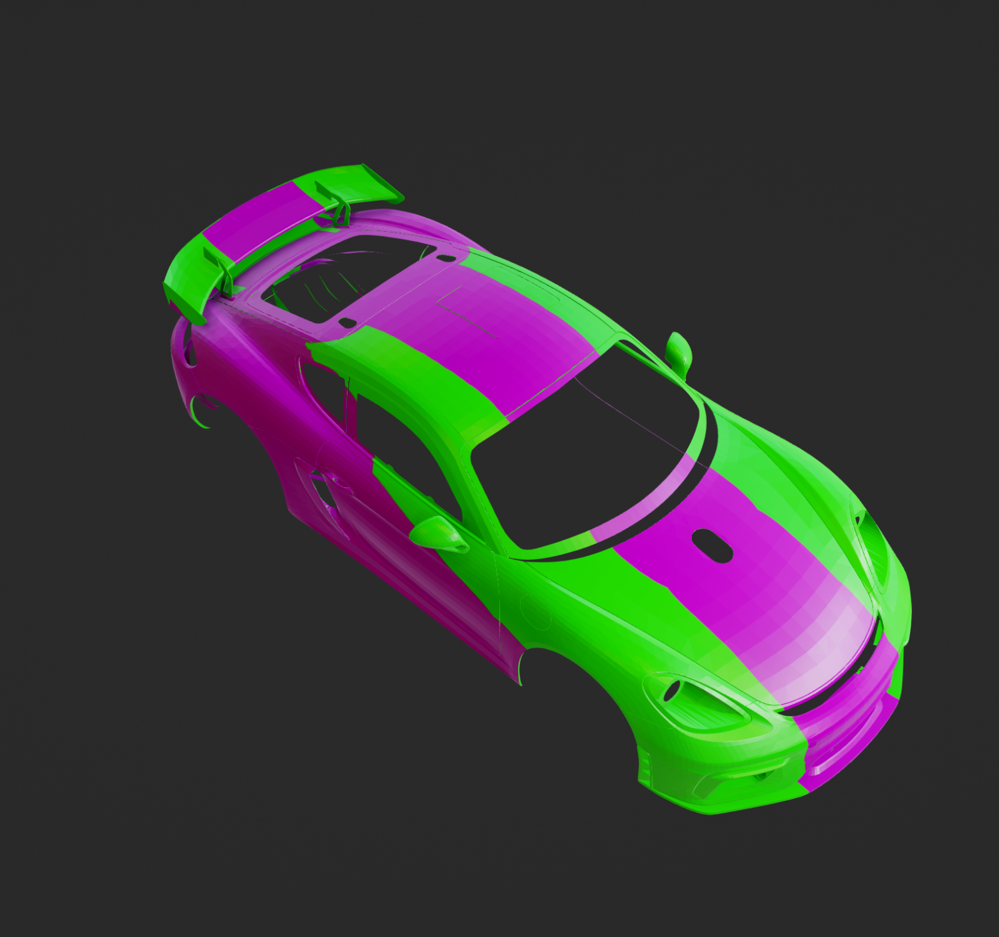
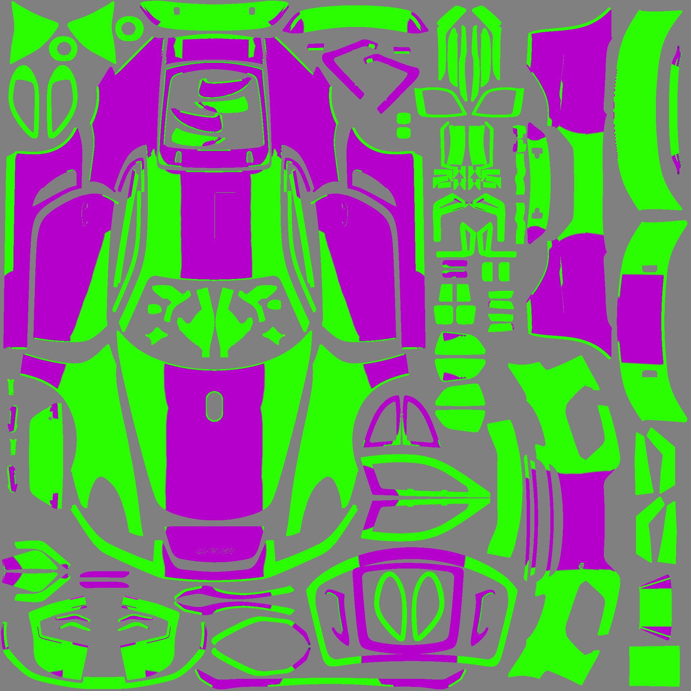

### Where V1 falls down

It works, and it's a large improvement over generating straight onto a raw UV sheet:

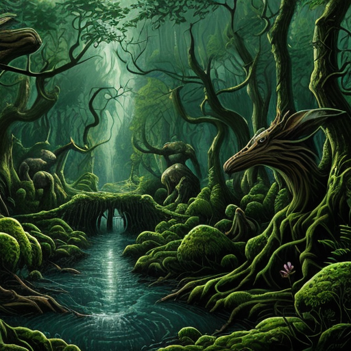
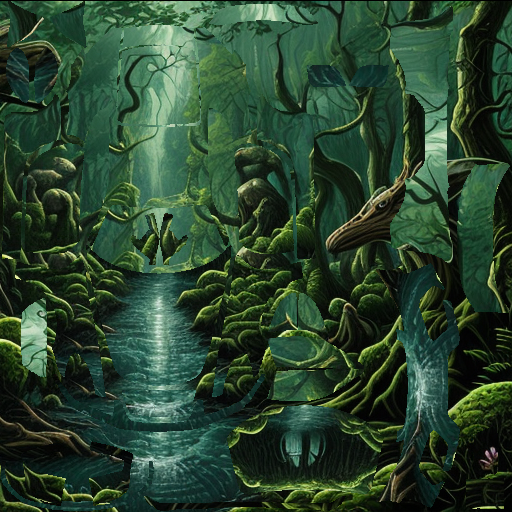
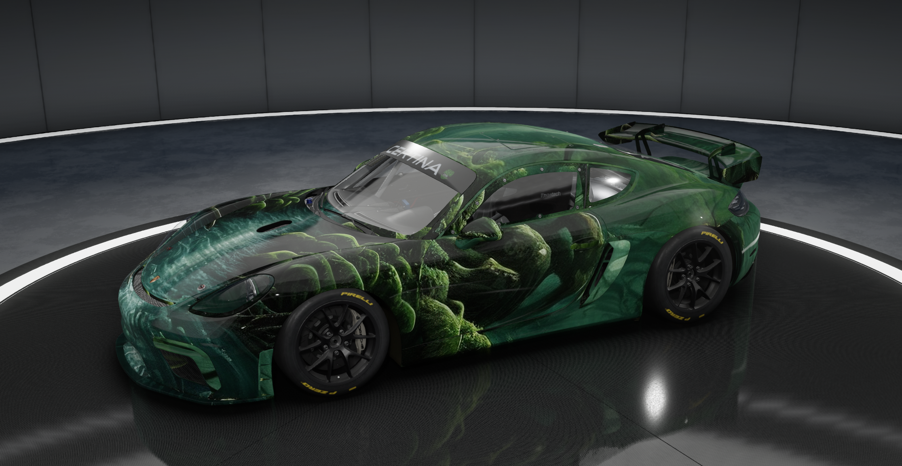

But the ceiling is low, and hitting it is what led to V2:

- Pieces can only translate and rotate. Real UV islands are warped, stretched and mirrored
  relative to the surface, and rigid transforms cannot express that, so seams never fully close.
- Every model needs a manual arrangement session.
- Overlapping pieces are unavoidable in a dense layout. Sometimes overlap even helps, which tells
  you how approximate the whole thing is.
- The arrangement is a human's guess at 3D adjacency, when the OBJ already contains the answer.

<details>
<summary><b>Full V1 walkthrough (ACC livery example)</b></summary>

This workflow generates an ACC livery and should work for most complex UV maps, though results
vary. It assumes you know how to set up a custom livery for ACC. If not, my
[video tutorial](https://www.youtube.com/watch?v=gyHiSUuZmRA) covers the base setup.

Steps 0 through 2 are done once per model and produce the base files for as many AI liveries as
you want.

**Prerequisites**

- [Automatic1111's Stable Diffusion web UI](https://github.com/AUTOMATIC1111/stable-diffusion-webui)
- [ControlNet extension](https://github.com/Mikubill/sd-webui-controlnet)

**Setup**

- Place `V1/ModelMasher.py` in the web UI's `scripts` folder.
- In `V1/ArrangementTool/`, run `web_ui.bat`.

**Step 0: download template files**

- Find the PSD template for your car skin. I use
  [this Google Drive folder](https://drive.google.com/drive/folders/1xh92HjkVp1ilkmx4F3_tpRB7dWt8pHlP).
- Optional, for the ArmorPaint segmentation route, grab the 3D OBJ template from
  [this folder](https://drive.google.com/drive/folders/1Vx2_fFr_LlEavvqd0rdJvkN7-Ly5lGNE).

**Step 1: prepare your wireframe**

- Open the template in Photoshop and keep only the UV layer visible. Aim for a white background,
  black wireframes, and a coloured outline per segment.
- Segments sometimes overlap. For more precision, mask each segment in white on black instead.
- Save as PNG, no larger than 2048x2048.

Your output should look like one of these:


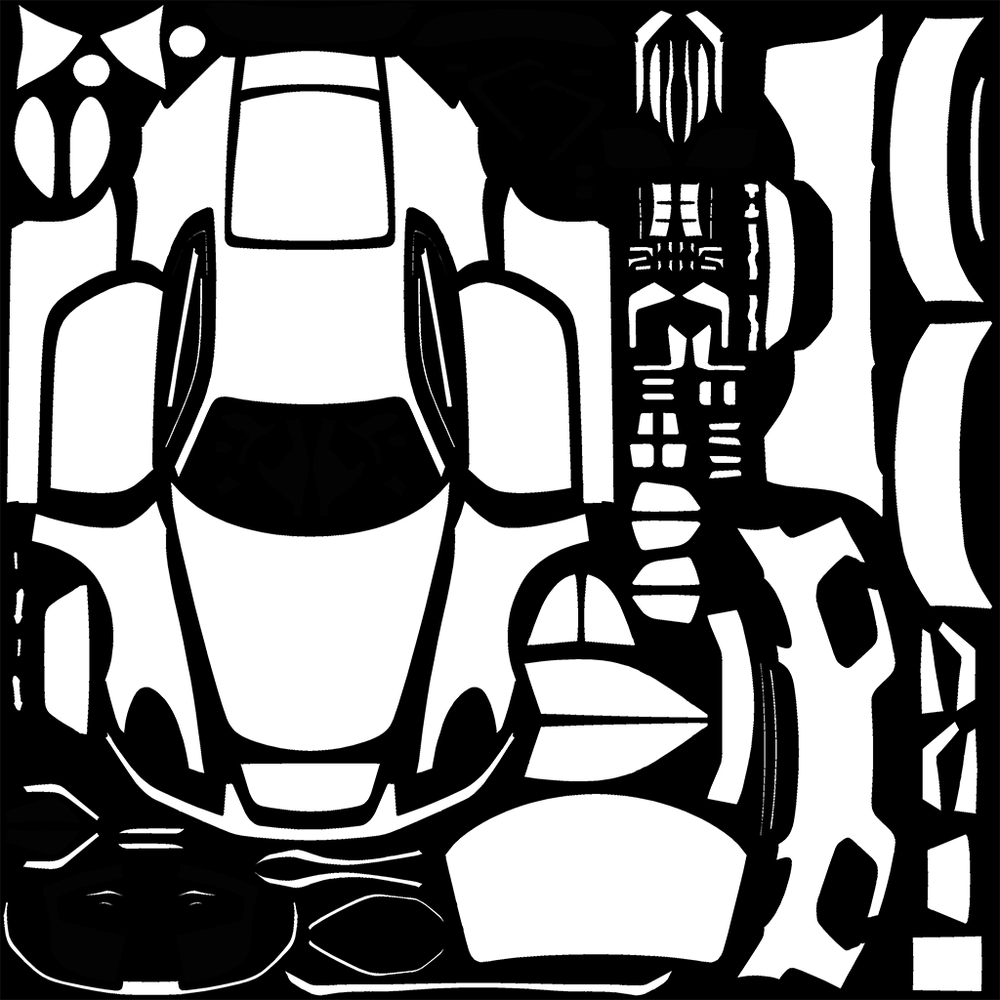

**Step 1.5 (optional): segmentation map for finer control**

You can base this on an existing livery or make it in Photoshop, but the quick and dirty way is
[ArmorPaint](https://armorpaint.org/).

- Import the OBJ you downloaded earlier.
- With X-ray on, max out your brush size and paint the whole thing a bright colour.
- Turn X-ray off and colour the segments you want to look distinct. No need to be exact, just get
  the idea in there. X mirror is useful for symmetry.
- ControlNet segmentation works well with large colour blocks, so avoid fine detail. Though
  experimenting is half the fun.
- File > Export Texture, preset `base_color`, everything else default. Save it next to your
  wireframe image.

**Step 2: create your arrangement**

- Run `web_ui.bat` in `V1/ArrangementTool/`. If a browser doesn't open, go to http://127.0.0.1:5000/.
- Select the wireframe or black and white image from step 1.
- Threshold controls how large a piece has to be to get picked up. Higher for large pieces only,
  lower to catch detail.
- Click **Upload Image**.
- Arrange the pieces where they logically belong on the car. Right click rotates, shift and scroll
  zooms. Overlaps are fine and sometimes better. Anything outside the bounding rect renders black.
- Optionally upload the segmentation image from step 1.5.
- Click **Save Mapping**. You get a JSON file, plus a transformed segmentation file if you supplied
  one, in the server's `output` folder.

**Step 3: generate**

- Launch the Stable Diffusion web UI and set your txt2img parameters. I like
  [deliberate_v3](https://civitai.com/models/4823/deliberate), DPM++ 2M Karras, 60 steps, 512x512,
  batch count 4 so I can pick a favourite.
- Optional ControlNet: under single image, select the segmentation image *output by step 2* (the
  one in `[serverfolder]/output`, not the one you supplied). Pick the model ending in `_seg`.
  Control weight sets how strongly it conforms. Too high gives odd artifacts at segment edges, so
  I use around 0.6. Lowering the end step lets SD blend the segmentation more naturally.
- Under Script, select **Model Masher** and pick the JSON from step 2.
  - Check black background if you want unarranged pieces left unskinned. I leave it off so the
    small pieces at least stay in the same palette.
- Enter a prompt. For this example: "wooded forrest, creatures, streams, trees, cliffs, painting".
- Model Masher outputs the base images first and the mashed ones after. Look for the ones with
  clean blocking and a contiguous image.
- Save the 512 version as your `decals.png` and check it in game before upscaling.


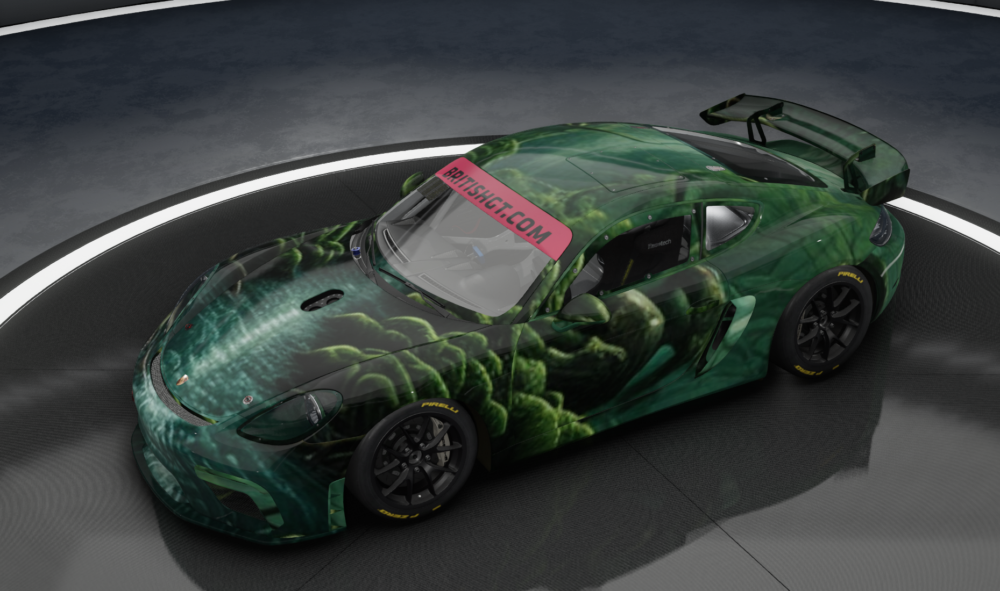

**Step 4: upscale**

Once you're happy with a generation:

- Click the painting icon below it to send it to img2img.
- Sampling steps at 60 minimum, DPM++ 2M Karras.
- Low denoising strength, around 0.2.
- CFG scale around 17.
- Under scripts pick SD upscale, scale factor 4, ESRGAN_4x upscaler.
- Generate, save as `decals.png`, preview in ACC.
- On a strong system, repeat to reach 4096x4096. Otherwise use Extras > single image > upscaler 1
  set to ESRGAN_4x.


</details>

---

## Repo layout

```
V1/
  ModelMasher.py              A1111 script: inverse affine remap of each UV island
  ArrangementTool/
    server.py                 Flask + OpenCV: contour detection, transform export, seg remap
    index.html                Canvas2D arrangement UI (drag, rotate, zoom)
    web_ui.bat                Launcher
    output/, uploads/         Saved maps and source templates from my own runs
V2/
  ModelMasherV2.py            A1111 script: orchestrates a headless Blender bake
  modelmasher/
    blenderApply.py           Runs inside Blender: import, project, bake, save
    material2.blend           The "Apply" projection material (the actual trick)
readmeimg/                    Screenshots and the V2 demo capture
```

## What I took away from it

The lesson that stuck: **most of the work in an AI feature is the non-AI part**. The diffusion
model was never the hard bit. The hard bit was the coordinate space it was being asked to paint
in, and the fix was geometry, not prompting or fine tuning. V1 spent a lot of effort building a
human in the loop approximation of information the OBJ already contained. V2 deleted that entire
step by asking the right tool for the answer.

The other one: reach for the tool that already solved your problem. Once I stopped trying to
reconstruct the surface to UV mapping in OpenCV and let Blender's baker do it, the code got
smaller *and* the output got better.

Along the way this covered writing custom Automatic1111 scripts, conditioning generation with
ControlNet segmentation maps, driving Blender headless from inside an inference pipeline, and a
fair amount of OpenCV contour and affine transform work.

## Special thanks

- [The UV texture workflow that kicked this project off for me](https://github.com/Mikubill/sd-webui-controlnet/discussions/204)
- [Trackilicious, the best ACC league out there, which makes me always want a tight livery](https://www.thesimgrid.com/hosts/trackilicious)
